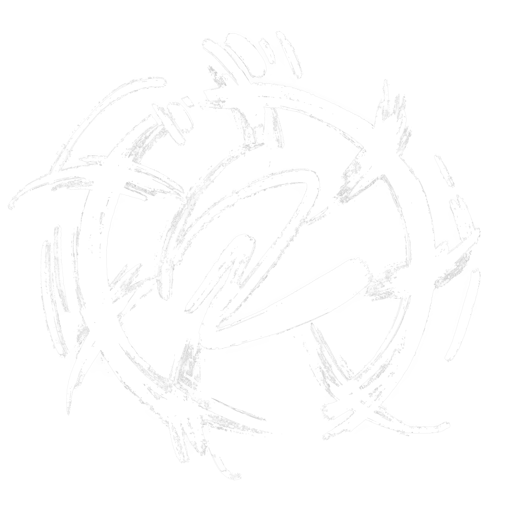

<div style="display: flex; flex-direction: column; justify-content: center; align-items: center;">


# Deadshot
</div>

[](https://github.com/cjhosken/deadshot/actions/workflows/linux.yml)
[](https://github.com/cjhosken/deadshot/actions/workflows/macos.yml)
[](https://github.com/cjhosken/deadshot/actions/workflows/windows.yml)

---

**Deadshot** is an open-source **SFM** and **AI-based camera tracking and motion capture** software.

---

## 📦 Development

Deadshot is **free and open-source**, and can be used in both non-commercial and commercial projects.

If you want to develop Deadshot yourself, follow the setup guide below.

### 1. Setup Python Virtual Environment
Always work inside a virtual environment:

```bash
# Create a new virtual environment
python3 -m venv .venv

# Activate the environment
# On Linux / macOS:
source .venv/bin/activate

# On Windows:
.\.venv\Scripts\Activate
