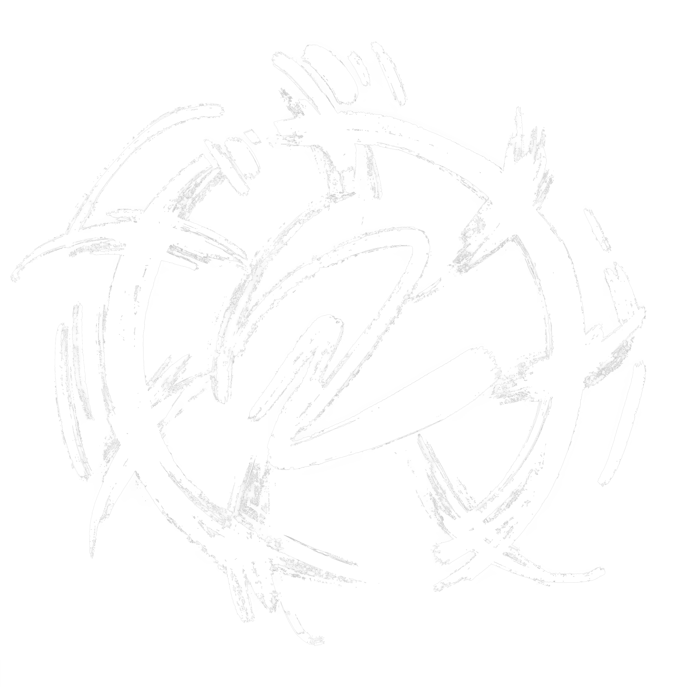

  

  
  

   

  

---

**Deadshot** is an open-source **AI-powered motion capture** tool that runs entirely in your **web browser** — no installs, no extra software needed.  

📖 Learn more → [**Deadshot Report**](https://cjhosken.github.io/blog/deadshot/)  

🚀 Try it out live → [**Deadshot**](https://cjhosken.github.io/deadshot/)  

---

## ✨ Features

- 🎥 **Web-based Motion Capture** — Works directly in the browser, zero setup required.  
- 🤖 **AI-powered Tracking** — Leverages AI for accurate real-time motion tracking.  
- 🧩 **Open Source** — 100% free to use, modify, and extend.  

---

## ToDo List
*Current active tasks in deadshot*

- ⭕ **Root bone transformation** — Global root movement based on webcam.

- 🏔️ **Ground Adaptation** — Adaptive foot locking, jumping?

## Current Limitations
*Deadshot is under active development and has the following known limitations:*

- ⚠️ **Motion Accuracy** — Tracking precision is still improving and will produce inconsistent or noisy results..
- 🚧 **Export Format** — Animation export is currently limited to the .glb format only.

## 📬 Contact & Info

Deadshot was created by **Christopher Hosken** as part of his **Research & Development project** at **Bournemouth University**.  

- 📧 Email: [hoskenchristopher@gmail.com](mailto:hoskenchristopher@gmail.com)  
- 🔗 LinkedIn: [christopher-hosken](https://www.linkedin.com/in/christopher-hosken/)  

---
